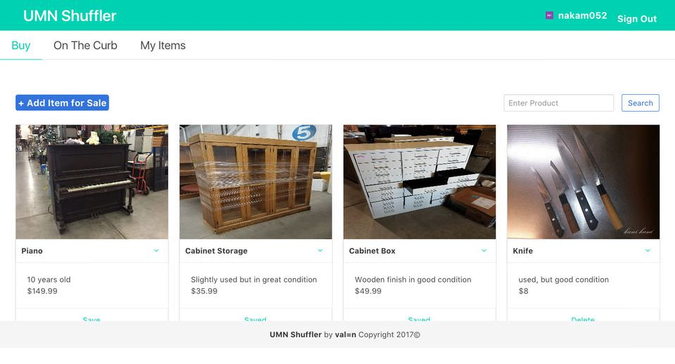
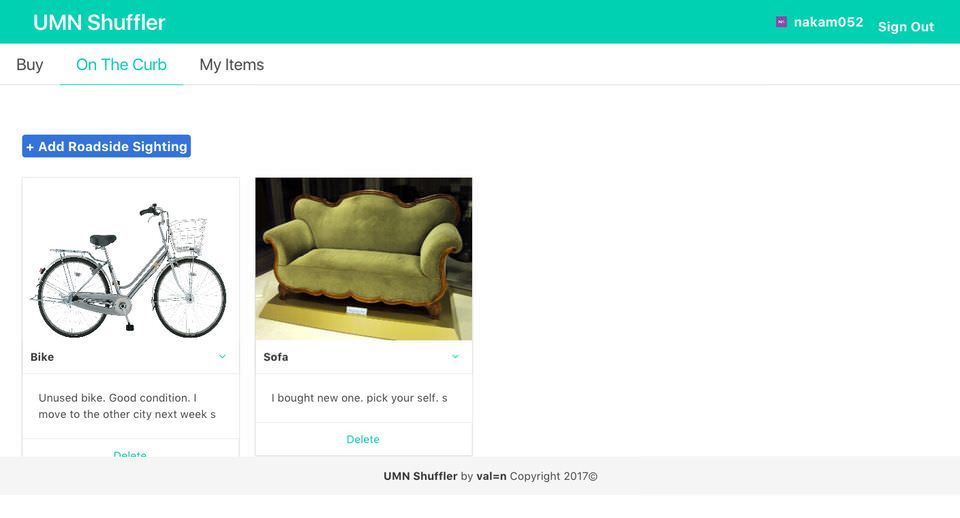
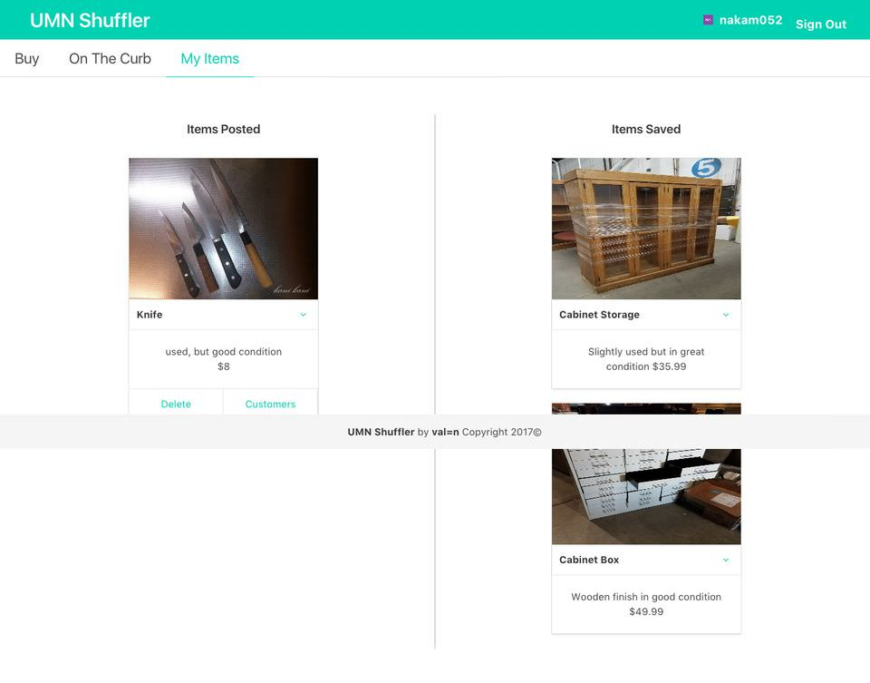
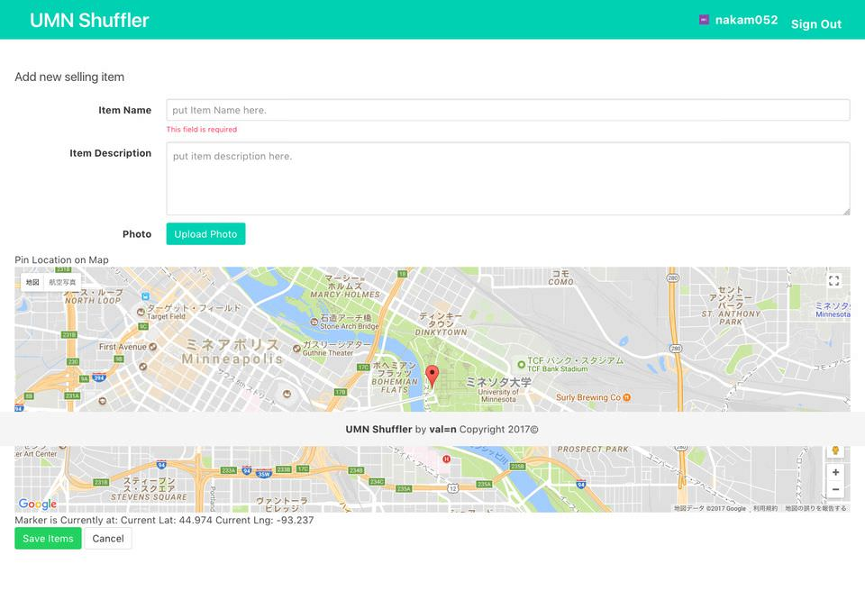

# Module 2 Group Assignment: Generation Station

CSCI 5117, Fall 2017, [assignment description](https://docs.google.com/document/d/1Z_NWRqz4M6dhsfzU2l9alMWpy0PK0xj38uP8qPEZvdY/edit?usp=sharing)

## App Info:

* Team Name: val=n
* App Name: UMN Shuffler
* App Link: <https://safe-gorge-65667.herokuapp.com/>

### Students

* Lakshya Goel, goel0072@umn.edu
* Nishka Monteiro, monte299@umn.edu
* Akifumi Nakamachi, nakam052@umn.edu
* Vaybhav Shaw, shaw0162@umn.edu

## Key Features

* Allows user to post something they want to sell.
* Provides a list of items on the curb with the location on the map.
* Protects Seller's privacy by posting a notification with the details of the prospective buyer.

## Screenshots of Site

**[Add a screenshot of each key page (maximum 4)](https://stackoverflow.com/questions/10189356/how-to-add-screenshot-to-readmes-in-github-repository)
along with a very brief caption:**

Top page(show all selling item posted by user)

On the curb page(show all free item on the curb information posted by user)

My item page(manage item added by user, and wishlist)

Item add page(on the curb version)

## External Dependencies
* jquery3.2.1: parsing dom, form processing
* multer: sending data from client to sever
* request: controlling http?. Maybe default to express. But to prevent plagiarism, I write that
* Sass: css preprocessor
* Ruby: to use Sass
* grunt: scss auto compile
* grunt-contrib: add grunt functionality(scss auto compile)
* grunt-contrib-scss: add grunt functionality(scss auto compile)
* grunt-contrib-watch: add grunt functionality(scss auto compile)
* express-hbs: we use express-hbs instead of hbs to customize hbs functionality(e.g. partial, helper)
* mongoDB: To store the data
* mongooseJS: To develop schemas for mongoDB
* auth0: Authentication library for User Sign Up and Sign In
* passport: Authentication middleware for node